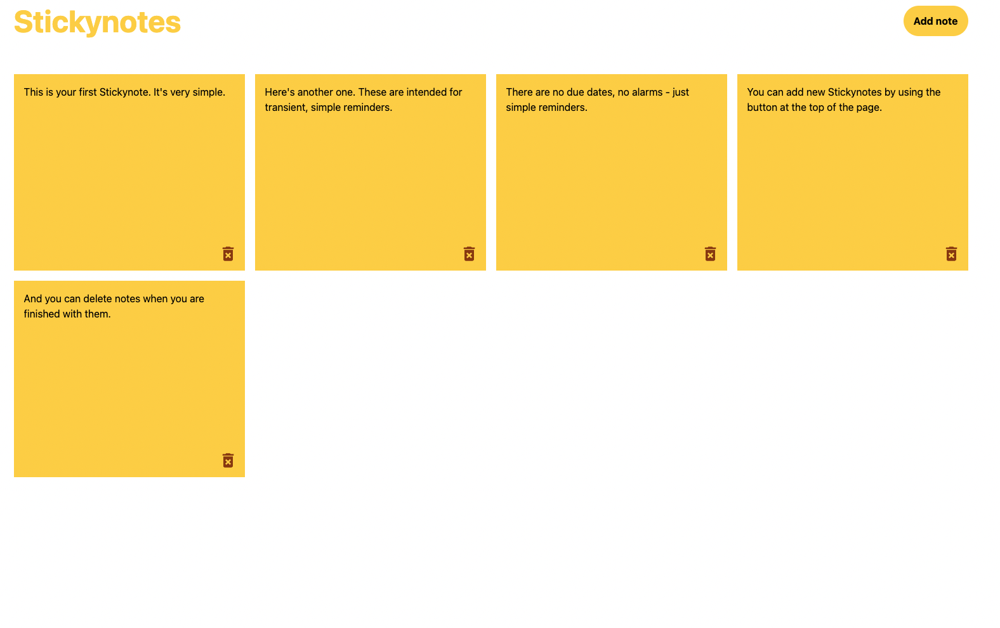

# Stickynotes

Stickynotes is a simple Post-it Note style note taking and reminder application. It features persistent storage - anyone who uses it can make as many notes as they like and they will persist between sessions. Using localStorage to hold persistent information was the goal of the project, and Stickynotes works handily in that regard.

Stickynotes contains some starter notes, but notes can be added or deleted, and existing notes can be edited.

I built this because I like using Post-it notes in my day to day. It was a decent challenge to make a simple project that had the goal of extreme simplicity; There are no due dates, no alarms. You can only add or delete notes. Each note is saved automatically, as you type. You do not have to enter a special edit mode to edit, simply click into the note you wish to edit and start typing.

The site is hosted at Vercel: [https://stickynotes-six.vercel.app/](https://stickynotes-six.vercel.app/).
